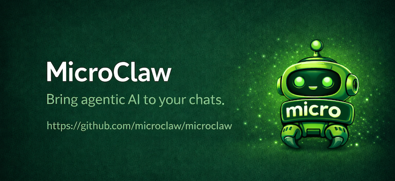
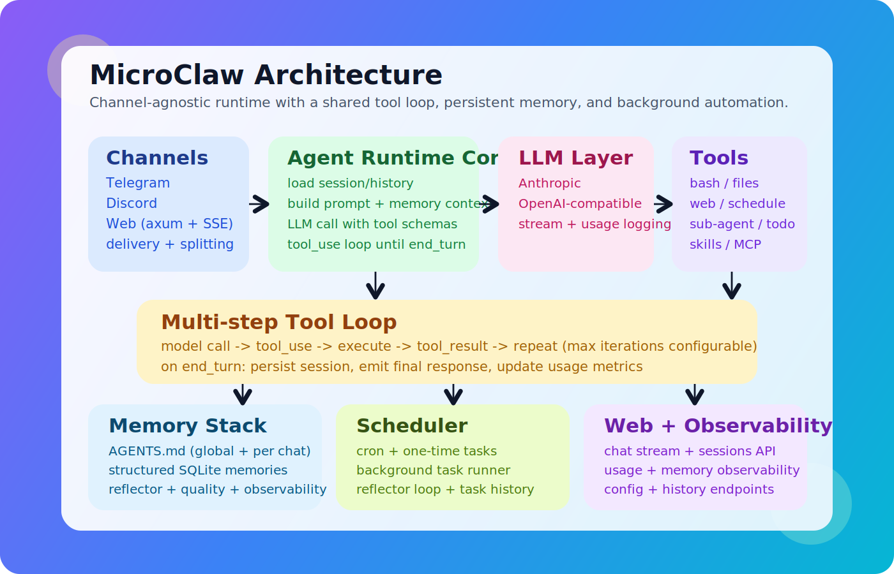
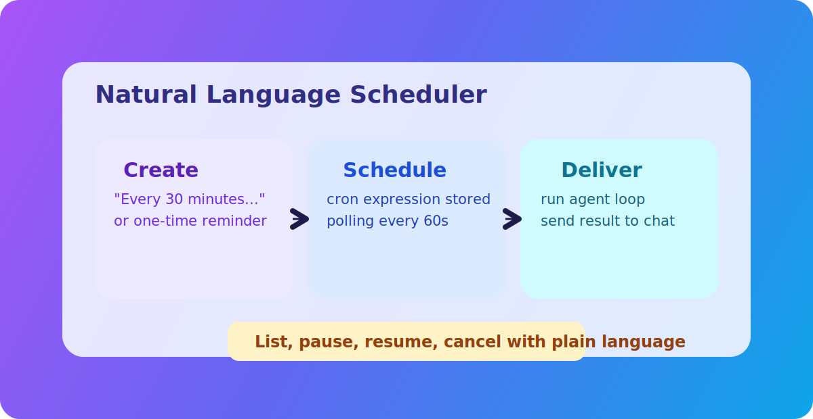
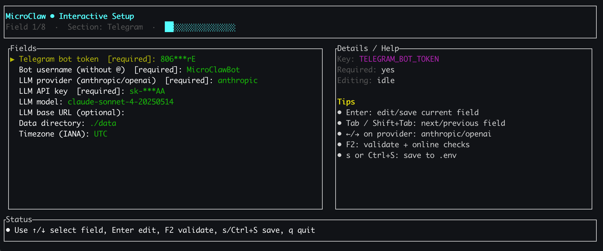

# MicroClaw


[English](README.md) | [中文](README_CN.md)

[](https://microclaw.ai)
[](https://discord.gg/pvmezwkAk5)
[](LICENSE)


<p align="center">
  
</p>


> **Note:** This project is under active development. Features may change, and contributions are welcome!


An agentic AI assistant for chat surfaces, inspired by [nanoclaw](https://github.com/gavrielc/nanoclaw/) and incorporating some of its design ideas. MicroClaw uses a channel-agnostic core with platform adapters: it currently supports Telegram, Discord, Slack, Feishu/Lark, IRC, and Web, and is designed to add more platforms over time. It works with multiple LLM providers (Anthropic + OpenAI-compatible APIs) and supports full tool execution: run shell commands, read/write/edit files, search codebases, browse the web, schedule tasks, and maintain persistent memory across conversations.


<p align="center">
  
  &nbsp;&nbsp;
  
</p>

## Table of contents

- [How it works](#how-it-works)
- [Install](#install)
- [Features](#features)
- [Tools](#tools)
- [Memory](#memory)
- [Skills](#skills)
- [MCP](#mcp)
- [Plan & Execute](#plan--execute)
- [Scheduling](#scheduling)
- [Local Web UI (cross-channel history)](#local-web-ui-cross-channel-history)
- [Release](#release)
- [Setup](#setup)
- [Configuration](#configuration)
- [Docker Sandbox](#docker-sandbox)
- [Platform behavior](#platform-behavior)
- [Multi-chat permission model](#multi-chat-permission-model)
- [Usage examples](#usage-examples)
- [Architecture](#architecture)
- [Adding a New Platform Adapter](#adding-a-new-platform-adapter)
- [Documentation](#documentation)

## Install

### One-line installer (recommended)

```sh
curl -fsSL https://microclaw.ai/install.sh | bash
```

### Windows PowerShell installer

```powershell
iwr https://microclaw.ai/install.ps1 -UseBasicParsing | iex
```

This installer only does one thing:
- Download and install the matching prebuilt binary from the latest GitHub release
- It does not fallback to Homebrew/Cargo inside `install.sh` (use separate methods below)

### Preflight diagnostics

Run cross-platform diagnostics before first start (or when troubleshooting):

```sh
microclaw doctor
```

Machine-readable output for support tickets:

```sh
microclaw doctor --json
```

Checks include PATH, shell runtime, `agent-browser`, PowerShell policy (Windows), and MCP command dependencies from `<data_dir>/mcp.json`.

Sandbox-only diagnostics:

```sh
microclaw doctor sandbox
```

### Uninstall (script)

macOS/Linux:

```sh
curl -fsSL https://microclaw.ai/uninstall.sh | bash
```

Windows PowerShell:

```powershell
iwr https://microclaw.ai/uninstall.ps1 -UseBasicParsing | iex
```

### Homebrew (macOS)

```sh
brew tap microclaw/tap
brew install microclaw
```

### From source

```sh
git clone https://github.com/microclaw/microclaw.git
cd microclaw
cargo build --release
cp target/release/microclaw /usr/local/bin/
```

Optional semantic-memory build (sqlite-vec disabled by default):

```sh
cargo build --release --features sqlite-vec
```

First-time sqlite-vec quickstart (3 commands):

```sh
cargo run --features sqlite-vec -- setup
cargo run --features sqlite-vec -- start
sqlite3 <data_dir>/runtime/microclaw.db "SELECT id, chat_id, chat_channel, external_chat_id, category, embedding_model FROM memories ORDER BY id DESC LIMIT 20;"
```

In `setup`, set:
- `embedding_provider` = `openai` or `ollama`
- provider credentials/base URL/model as needed

## How it works

Every message triggers an **agentic loop**: the model can call tools, inspect the results, call more tools, and reason through multi-step tasks before responding. Up to 100 iterations per request by default.

<p align="center">
  
</p>

## Blog post

For a deeper dive into the architecture and design decisions, read: **[Building MicroClaw: An Agentic AI Assistant in Rust That Lives in Your Chats](https://microclaw.ai/blog/building-microclaw)**

## Features

- **Agentic tool use** -- bash commands, file read/write/edit, glob search, regex grep, persistent memory
- **Session resume** -- full conversation state (including tool interactions) persisted between messages; the agent keeps tool-call state across invocations
- **Context compaction** -- when sessions grow too large, older messages are automatically summarized to stay within context limits
- **Sub-agent** -- delegate self-contained sub-tasks to a parallel agent with restricted tools
- **Agent skills** -- extensible skill system ([Anthropic Skills](https://github.com/anthropics/skills) compatible); skills are auto-discovered from `<data_dir>/skills/` and activated on demand
- **Plan & execute** -- todo list tools for breaking down complex tasks, tracking progress step by step
- **Platform-extensible architecture** -- shared agent loop + tool system + storage, with platform adapters for channel-specific ingress/egress
- **Web search** -- search the web via DuckDuckGo and fetch/parse web pages
- **Scheduled tasks** -- cron-based recurring tasks and one-time scheduled tasks, managed through natural language
- **Mid-conversation messaging** -- the agent can send intermediate messages before its final response
- **Mention catch-up (Telegram groups)** -- when mentioned in a Telegram group, the bot reads all messages since its last reply (not just the last N)
- **Continuous typing indicator** -- typing indicator stays active for the full duration of processing
- **Persistent memory** -- AGENTS.md files at global and per-chat scopes, loaded into every request
- **Message splitting** -- long responses are automatically split at newline boundaries to fit channel limits (Telegram 4096 / Discord 2000 / Slack 4000 / Feishu 4000 / IRC ~380)

## Tools

| Tool | Description |
|------|-------------|
| `bash` | Execute shell commands with configurable timeout |
| `read_file` | Read files with line numbers, optional offset/limit |
| `write_file` | Create or overwrite files (auto-creates directories) |
| `edit_file` | Find-and-replace editing with uniqueness validation |
| `glob` | Find files by pattern (`**/*.rs`, `src/**/*.ts`) |
| `grep` | Regex search across file contents |
| `read_memory` | Read persistent AGENTS.md memory (global or per-chat) |
| `write_memory` | Write persistent AGENTS.md memory |
| `web_search` | Search the web via DuckDuckGo (returns titles, URLs, snippets) |
| `web_fetch` | Fetch a URL and return plain text (HTML stripped, max 20KB) |
| `send_message` | Send mid-conversation messages; supports attachments for Telegram/Discord via `attachment_path` + optional `caption` |
| `schedule_task` | Schedule a recurring (cron) or one-time task |
| `list_scheduled_tasks` | List all active/paused tasks for a chat |
| `pause_scheduled_task` | Pause a scheduled task |
| `resume_scheduled_task` | Resume a paused task |
| `cancel_scheduled_task` | Cancel a task permanently |
| `get_task_history` | View execution history for a scheduled task |
| `export_chat` | Export chat history to markdown |
| `sub_agent` | Delegate a sub-task to a parallel agent with restricted tools |
| `activate_skill` | Activate an agent skill to load specialized instructions |
| `sync_skills` | Sync a skill from external registry (e.g. vercel-labs/skills) and normalize local frontmatter |
| `todo_read` | Read the current task/plan list for a chat |
| `todo_write` | Create or update the task/plan list for a chat |

Generated reference (source-of-truth, anti-drift):
- `docs/generated/tools.md`
- `docs/generated/config-defaults.md`
- `docs/generated/provider-matrix.md`

Regenerate with:
```sh
node scripts/generate_docs_artifacts.mjs
```

## Memory

<p align="center">
  
</p>

MicroClaw maintains persistent memory via `AGENTS.md` files:

```
<data_dir>/runtime/groups/
    AGENTS.md                 # Global memory (shared across all chats)
    {chat_id}/
        AGENTS.md             # Per-chat memory
```

Memory is loaded into the system prompt on every request. The model can read and update memory through tools -- tell it to "remember that I prefer Python" and it will persist across sessions.

MicroClaw also keeps structured memory rows in SQLite (`memories` table):
- `write_memory` persists to file memory and structured memory
- Background reflector extracts durable facts incrementally and deduplicates
- Explicit "remember ..." commands use a deterministic fast path (direct structured-memory upsert)
- Low-quality/noisy memories are filtered by quality gates before insertion
- Memory lifecycle is managed with confidence + soft-archive fields (instead of hard delete)

Optional memory MCP backend:
- If MCP config includes a server exposing both `memory_query` and `memory_upsert`, structured-memory operations prefer that MCP server.
- If MCP is not configured, unavailable, or returns invalid payloads, MicroClaw automatically falls back to built-in SQLite memory behavior.

When built with `--features sqlite-vec` and embedding config is set, structured-memory retrieval and dedup use semantic KNN. Otherwise, it falls back to keyword relevance + Jaccard dedup.

`/usage` now includes a **Memory Observability** section (and Web UI panel) showing:
- memory pool health (active/archived/low-confidence)
- reflector throughput (insert/update/skip in 24h)
- injection coverage (selected vs candidate memories in 24h)

### Chat Identity Mapping

MicroClaw now stores a channel-scoped identity for chats:

- `internal chat_id`: SQLite primary key used by sessions/messages/tasks
- `channel + external_chat_id`: source chat identity from Telegram/Discord/Slack/Feishu/IRC/Web

This avoids collisions when different channels can have the same numeric id. Legacy rows are migrated automatically on startup.

Useful SQL for debugging:

```sql
SELECT chat_id, channel, external_chat_id, chat_type, chat_title
FROM chats
ORDER BY last_message_time DESC
LIMIT 50;

SELECT id, chat_id, chat_channel, external_chat_id, category, content, embedding_model
FROM memories
ORDER BY id DESC
LIMIT 50;
```

## Skills

<p align="center">
  
</p>

MicroClaw supports the [Anthropic Agent Skills](https://github.com/anthropics/skills) standard. Skills are modular packages that give the bot specialized capabilities for specific tasks.

```
<data_dir>/skills/
    pdf/
        SKILL.md              # Required: name, description + instructions
    docx/
        SKILL.md
```

**How it works:**
1. Skill metadata (name + description) is always included in the system prompt (~100 tokens per skill)
2. When the model determines a skill is relevant, it calls `activate_skill` to load the full instructions
3. The model follows the skill instructions to complete the task

**Built-in skills:** pdf, docx, xlsx, pptx, skill-creator, apple-notes, apple-reminders, apple-calendar, weather, find-skills

**New macOS skills (examples):**
- `apple-notes` -- manage Apple Notes via `memo`
- `apple-reminders` -- manage Apple Reminders via `remindctl`
- `apple-calendar` -- query/create Calendar events via `icalBuddy` + `osascript`
- `weather` -- quick weather lookup via `wttr.in`

**Adding a skill:** Create a subdirectory under `<data_dir>/skills/` with a `SKILL.md` file containing YAML frontmatter and markdown instructions.

Supported frontmatter fields:
- `name`, `description`
- `platforms` (optional): e.g. `[darwin, linux, windows]`
- `deps` (optional): required commands in `PATH`
- `compatibility.os` / `compatibility.deps` (also supported)

Unavailable skills are filtered automatically by platform/dependencies, so unsupported skills do not appear in `/skills`.

**Commands:**
- `/skills` -- list all available skills
- `/usage` -- show token usage summary (current chat + global totals)

## MCP

MicroClaw supports MCP servers configured in `<data_dir>/mcp.json` with protocol negotiation and configurable transport.

- Default protocol version: `2025-11-05` (overridable globally or per server)
- Supported transports: `stdio`, `streamable_http`

Recommended production start (minimal local MCP only):

```sh
cp mcp.minimal.example.json <data_dir>/mcp.json
```

Full example (includes optional remote streamable HTTP server):

```sh
cp mcp.example.json <data_dir>/mcp.json
```

Example:

```json
{
  "defaultProtocolVersion": "2025-11-05",
  "mcpServers": {
    "filesystem": {
      "transport": "stdio",
      "command": "npx",
      "args": ["-y", "@modelcontextprotocol/server-filesystem", "."]
    },
    "remote": {
      "transport": "streamable_http",
      "endpoint": "http://127.0.0.1:8080/mcp"
    }
  }
}
```

### Browser Automation with Playwright MCP

To give your agent access to a real browser with your existing logins (cookies, sessions), use the [Playwright MCP](https://github.com/microsoft/playwright-mcp) server in **extension mode**:

1. Install the **Playwright MCP Bridge** extension from the [Chrome Web Store](https://chromewebstore.google.com/detail/playwright-mcp-bridge)
2. Click the extension icon and copy the `PLAYWRIGHT_MCP_EXTENSION_TOKEN`
3. Add to your `mcp.json`:

```json
{
  "mcpServers": {
    "playwright": {
      "transport": "stdio",
      "command": "npx",
      "args": ["-y", "@playwright/mcp@latest", "--extension"],
      "env": {
        "PLAYWRIGHT_MCP_EXTENSION_TOKEN": "<your-token-here>"
      }
    }
  }
}
```

This connects directly to your running Chrome via the extension's `chrome.debugger` API — no `--remote-debugging-port` flag needed. Your agent gets full access to your logged-in sessions (X, Google, GitHub, etc.) without any CDP setup.

> **Note:** Chrome 136+ blocks `--remote-debugging-port` on the default user data directory and DPAPI cookie encryption is path-bound on Windows, so CDP-based approaches (`--cdp-endpoint`) will not preserve logins. Extension mode is the recommended solution.

Migration evaluation to official Rust SDK is tracked in `docs/mcp-sdk-evaluation.md`.

Validation:

```sh
RUST_LOG=info cargo run -- start
```

Look for log lines like `MCP server '...' connected (...)`.

## Plan & Execute

<p align="center">
  
</p>

For complex, multi-step tasks, the bot can create a plan and track progress:

```
You: Set up a new Rust project with CI, tests, and documentation
Bot: [creates a todo plan, then executes each step, updating progress]

1. [x] Create project structure
2. [x] Add CI configuration
3. [~] Write unit tests
4. [ ] Add documentation
```

Todo lists are stored at `<data_dir>/runtime/groups/{chat_id}/TODO.json` and persist across sessions.

## Scheduling

<p align="center">
  
</p>

The bot supports scheduled tasks via natural language:

- **Recurring:** "Remind me to check the logs every 30 minutes" -- creates a cron task
- **One-time:** "Remind me at 5pm to call Alice" -- creates a one-shot task

Under the hood, recurring tasks use 6-field cron expressions (sec min hour dom month dow). The scheduler polls every 60 seconds for due tasks, runs the agent loop with the task prompt, and sends results to the originating chat.

Manage tasks with natural language:
```
"List my scheduled tasks"
"Pause task #3"
"Resume task #3"
"Cancel task #3"
```

## Local Web UI (cross-channel history)

When `web_enabled: true`, MicroClaw serves a local Web UI (default `http://127.0.0.1:10961`).

- Session list includes chats from all channels stored in SQLite (`telegram`, `discord`, `slack`, `feishu`, `irc`, `web`)
- You can review and manage history (refresh / clear context / delete)
- Non-web channels are read-only in Web UI by default (send from source channel)
- If there are no sessions yet, Web UI auto-generates a new key like `session-YYYYMMDDHHmmss`
- The first message in that session automatically persists it in SQLite

## Release

Publish both installer mode (GitHub Release asset used by `install.sh`) and Homebrew mode with one command:

```sh
./deploy.sh
```

## Setup

> **New:** MicroClaw now includes an interactive setup wizard (`microclaw setup`) and will auto-launch it on first `start` when required config is missing.

### 1. Create channel bot credentials

Enable at least one channel: Telegram, Discord, Slack, Feishu/Lark, IRC, or Web UI.

Telegram (optional):
1. Open Telegram and search for [@BotFather](https://t.me/BotFather)
2. Send `/newbot`
3. Enter a display name for your bot (e.g. `My MicroClaw`)
4. Enter a username (must end in `bot`, e.g. `my_microclaw_bot`)
5. BotFather will reply with a token like `123456789:ABCdefGHIjklMNOpqrsTUVwxyz` -- save this as `telegram_bot_token` (legacy single-account) or `channels.telegram.accounts.<id>.bot_token` (recommended multi-account)

Recommended BotFather settings (optional but useful):
- `/setdescription` -- set a short description shown in the bot's profile
- `/setcommands` -- register commands so users see them in the menu:
  ```
  reset - Clear current session
  skills - List available agent skills
  ```
- `/setprivacy` -- set to `Disable` if you want the bot to see all group messages (not just @mentions)

Discord (optional):
1. Open the [Discord Developer Portal](https://discord.com/developers/applications)
2. Create an application and add a bot
3. Copy the bot token and save it as `discord_bot_token`
4. Invite the bot to your server with `Send Messages`, `Read Message History`, and mention permissions
5. Optional: set `discord_allowed_channels` to restrict where the bot can reply

Slack (optional, Socket Mode):
1. Create an app at [api.slack.com/apps](https://api.slack.com/apps)
2. Enable Socket Mode and get an `app_token` (starts with `xapp-`)
3. Add `bot_token` scope and install to workspace to get `bot_token` (starts with `xoxb-`)
4. Subscribe to `message` and `app_mention` events
5. Configure under `channels.slack` in config

Feishu/Lark (optional):
1. Create an app at the [Feishu Open Platform](https://open.feishu.cn/app) (or [Lark Developer](https://open.larksuite.com/app) for international)
2. Get `app_id` and `app_secret` from app credentials
3. Enable `im:message` and `im:message.receive_v1` event subscription
4. Choose connection mode: WebSocket (default, no public URL needed) or Webhook
5. Configure under `channels.feishu` in config; set `domain: "lark"` for international

IRC (optional):
1. Prepare an IRC server endpoint, port, and bot nick
2. Configure under `channels.irc` in config (`server`, `nick`, `channels` are required)
3. Optional: enable TLS with `tls: "true"` and set `tls_server_name` if needed
4. Optional: set `mention_required: "false"` if you want replies in channels without mention

### 2. Get an LLM API key

Choose a provider and create an API key:
- Anthropic: [console.anthropic.com](https://console.anthropic.com/)
- OpenAI: [platform.openai.com](https://platform.openai.com/)
- Or any OpenAI-compatible provider (OpenRouter, DeepSeek, etc.)
- For `openai-codex`, you can use OAuth (`codex login`) or an API key (for OpenAI-compatible proxy endpoints).

### 3. Configure (recommended: interactive Q&A)

```sh
microclaw setup
```

<!-- Setup wizard screenshot placeholder -->
<!-- Replace with real screenshot later -->


The `config` flow provides:
- Question-by-question prompts with defaults (`Enter` to confirm quickly)
- Provider selection + model selection (numbered choices with custom override)
- Better Ollama UX: local model auto-detection + sensible local defaults
- Channel credentials are written in multi-account form by default (`channels.<channel>.default_account` + `channels.<channel>.accounts.main`)
- Safe `microclaw.config.yaml` save with automatic backup
- Auto-created directories for `data_dir` and `working_dir`

If you prefer the full-screen TUI, you can still run:

```sh
microclaw setup
```

Provider presets available in the wizard:
- `openai`
- `openai-codex` (ChatGPT/Codex subscription OAuth; run `codex login`)
- `openrouter`
- `anthropic`
- `ollama`
- `google`
- `alibaba`
- `deepseek`
- `moonshot`
- `mistral`
- `azure`
- `bedrock`
- `zhipu`
- `minimax`
- `cohere`
- `tencent`
- `xai`
- `huggingface`
- `together`
- `custom` (manual provider/model/base URL)

For Ollama, `llm_base_url` defaults to `http://127.0.0.1:11434/v1`, `api_key` is optional, and the interactive setup wizard can auto-detect locally installed models.

For `openai-codex`, you can run `codex login` first and MicroClaw will read OAuth from `~/.codex/auth.json` (or `$CODEX_HOME/auth.json`). You can also provide `api_key` when using an OpenAI-compatible proxy endpoint. The default base URL is `https://chatgpt.com/backend-api`.

You can still configure manually with `microclaw.config.yaml`:

```
telegram_bot_token: "123456:ABC-DEF1234..."
bot_username: "my_bot"
# recommended Telegram multi-account mode (multi-token, multi-bot):
# channels:
#   telegram:
#     default_account: "main"
#     # optional: only allow these Telegram user IDs in private chats (DM)
#     # allowed_user_ids: [123456789]
#     accounts:
#       main:
#         bot_token: "123456:ABC-DEF1234..."
#         bot_username: "my_bot"
#         # optional per-account DM allowlist (overrides channel-level list)
#         # allowed_user_ids: [123456789]
#       support:
#         bot_token: "987654:XYZ-DEF9999..."
#         bot_username: "support_bot"
# recommended Discord multi-account mode:
# channels:
#   discord:
#     default_account: "main"
#     accounts:
#       main:
#         bot_token: "DISCORD_TOKEN_MAIN"
#       ops:
#         bot_token: "DISCORD_TOKEN_OPS"
#         no_mention: true
#         allowed_channels: [123456789012345678]
# recommended Slack multi-account mode:
# channels:
#   slack:
#     default_account: "main"
#     accounts:
#       main:
#         bot_token: "xoxb-main..."
#         app_token: "xapp-main..."
#       support:
#         bot_token: "xoxb-support..."
#         app_token: "xapp-support..."
#         allowed_channels: ["C123ABC456"]
# recommended Feishu multi-account mode:
# channels:
#   feishu:
#     default_account: "main"
#     accounts:
#       main:
#         app_id: "cli_xxx"
#         app_secret: "xxx"
#       intl:
#         app_id: "cli_yyy"
#         app_secret: "yyy"
#         domain: "lark"
# recommended IRC mode:
# channels:
#   irc:
#     server: "irc.example.com"
#     port: "6697"
#     nick: "microclaw"
#     channels: "#general,#ops"
#     tls: "true"
#     mention_required: "true"
llm_provider: "anthropic"
api_key: "sk-ant-..."
model: "claude-sonnet-4-20250514"
# optional
# llm_base_url: "https://..."
data_dir: "~/.microclaw"
working_dir: "~/.microclaw/working_dir"
working_dir_isolation: "chat" # optional; defaults to "chat" if omitted
sandbox:
  mode: "off" # optional; default off. set "all" to run bash in docker sandbox
max_document_size_mb: 100
memory_token_budget: 1500
timezone: "UTC"
# optional semantic memory runtime config (requires --features sqlite-vec build)
# embedding_provider: "openai"   # openai | ollama
# embedding_api_key: "sk-..."
# embedding_base_url: "https://api.openai.com/v1"
# embedding_model: "text-embedding-3-small"
# embedding_dim: 1536
```

### 4. Run

```sh
microclaw start
```

### 5. Run as persistent gateway service (optional)

```sh
microclaw gateway install
microclaw gateway status
microclaw gateway status --json
```

Manage service lifecycle:

```sh
microclaw gateway install --force
microclaw gateway start
microclaw gateway stop
microclaw gateway restart
microclaw gateway logs 200
microclaw gateway uninstall
```

Notes:
- macOS uses `launchd` user agents.
- Linux uses `systemd --user`.
- Runtime logs are written to `<data_dir>/runtime/logs/`.
- Gateway service stdout/stderr files are `microclaw-gateway.log` and `microclaw-gateway.error.log`.
- Logs older than 30 days are deleted automatically.

## Configuration

All configuration is via `microclaw.config.yaml`:

| Key | Required | Default | Description |
|----------|----------|---------|-------------|
| `telegram_bot_token` | No* | -- | Telegram bot token from BotFather (legacy single-account mode) |
| `channels.telegram.default_account` | No | unset | Default Telegram account ID in multi-account mode |
| `channels.telegram.accounts.<id>.bot_token` | No* | unset | Telegram bot token for a specific account (recommended multi-account mode) |
| `channels.telegram.accounts.<id>.bot_username` | No | unset | Telegram username for a specific account (without `@`) |
| `channels.telegram.allowed_user_ids` | No | `[]` | Optional Telegram private chat sender allowlist at channel scope |
| `channels.telegram.accounts.<id>.allowed_groups` | No | `[]` | Optional Telegram group allowlist scoped to one account |
| `channels.telegram.accounts.<id>.allowed_user_ids` | No | `[]` | Optional Telegram private chat sender allowlist scoped to one account (overrides channel scope) |
| `discord_bot_token` | No* | -- | Discord bot token from Discord Developer Portal |
| `channels.discord.default_account` | No | unset | Default Discord account ID in multi-account mode |
| `channels.discord.accounts.<id>.bot_token` | No* | unset | Discord bot token for a specific account |
| `channels.discord.accounts.<id>.allowed_channels` | No | `[]` | Optional Discord channel allowlist scoped to one account |
| `channels.discord.accounts.<id>.no_mention` | No | `false` | If true, that Discord account responds in guild channels without @mention |
| `discord_allowed_channels` | No | `[]` | Discord channel ID allowlist; empty means no channel restriction |
| `api_key` | Yes* | -- | LLM API key (`ollama` can leave this empty; `openai-codex` supports OAuth or `api_key`) |
| `bot_username` | No | -- | Telegram bot username (without @; needed for Telegram group mentions) |
| `llm_provider` | No | `anthropic` | Provider preset ID (or custom ID). `anthropic` uses native Anthropic API, others use OpenAI-compatible API |
| `model` | No | provider-specific | Model name |
| `model_prices` | No | `[]` | Optional per-model pricing table (USD per 1M tokens) used by `/usage` cost estimates |
| `llm_base_url` | No | provider preset default | Custom provider base URL |
| `data_dir` | No | `~/.microclaw` | Data root (`runtime` data in `data_dir/runtime`, skills in `data_dir/skills`) |
| `working_dir` | No | `~/.microclaw/working_dir` | Default working directory for tool operations; relative paths in `bash/read_file/write_file/edit_file/glob/grep` resolve from here |
| `working_dir_isolation` | No | `chat` | Working directory isolation mode for `bash/read_file/write_file/edit_file/glob/grep`: `shared` uses `working_dir/shared`, `chat` isolates each chat under `working_dir/chat/<channel>/<chat_id>` |
| `sandbox.mode` | No | `off` | Container sandbox mode for bash tool execution: `off` runs on host; `all` routes bash commands into docker containers |
| `sandbox.mount_allowlist_path` | No | unset | Optional external mount allowlist file (one allowed root path per line) |
| `max_tokens` | No | `8192` | Max tokens per model response |
| `max_tool_iterations` | No | `100` | Max tool-use loop iterations per message |
| `max_document_size_mb` | No | `100` | Maximum allowed size for inbound Telegram documents; larger files are rejected with a hint message |
| `memory_token_budget` | No | `1500` | Estimated token budget for injecting structured memories into prompt context |
| `max_history_messages` | No | `50` | Number of recent messages sent as context |
| `control_chat_ids` | No | `[]` | Chat IDs that can perform cross-chat actions (send_message/schedule/export/memory global/todo) |
| `max_session_messages` | No | `40` | Message count threshold that triggers context compaction |
| `compact_keep_recent` | No | `20` | Number of recent messages to keep verbatim during compaction |
| `embedding_provider` | No | unset | Runtime embedding provider (`openai` or `ollama`) for semantic memory retrieval; requires `--features sqlite-vec` build |
| `embedding_api_key` | No | unset | API key for embedding provider (optional for `ollama`) |
| `embedding_base_url` | No | provider default | Optional base URL override for embedding provider |
| `embedding_model` | No | provider default | Embedding model ID |
| `embedding_dim` | No | provider default | Embedding vector dimension for sqlite-vec index initialization |
| `channels.slack.default_account` | No | unset | Default Slack account ID in multi-account mode |
| `channels.slack.accounts.<id>.bot_token` | No* | unset | Slack bot token for a specific account |
| `channels.slack.accounts.<id>.app_token` | No* | unset | Slack app token (Socket Mode) for a specific account |
| `channels.slack.accounts.<id>.allowed_channels` | No | `[]` | Optional Slack channel allowlist scoped to one account |
| `channels.feishu.default_account` | No | unset | Default Feishu/Lark account ID in multi-account mode |
| `channels.feishu.accounts.<id>.app_id` | No* | unset | Feishu/Lark app ID for a specific account |
| `channels.feishu.accounts.<id>.app_secret` | No* | unset | Feishu/Lark app secret for a specific account |
| `channels.feishu.accounts.<id>.domain` | No | `feishu` | Feishu domain for that account (`feishu`, `lark`, or custom URL) |
| `channels.feishu.accounts.<id>.allowed_chats` | No | `[]` | Optional Feishu chat allowlist scoped to one account |
| `channels.irc.server` | No* | unset | IRC server host/IP |
| `channels.irc.port` | No | `"6667"` | IRC server port |
| `channels.irc.nick` | No* | unset | IRC bot nick |
| `channels.irc.username` | No | unset | IRC username (defaults to nick) |
| `channels.irc.real_name` | No | `"MicroClaw"` | IRC real name (sent in USER command) |
| `channels.irc.channels` | No* | unset | Comma-separated channel list (for example `#general,#ops`) |
| `channels.irc.password` | No | unset | Optional IRC server password |
| `channels.irc.mention_required` | No | `"true"` | In channel chats, require mention before replying |
| `channels.irc.tls` | No | `"false"` | Enable IRC TLS connection |
| `channels.irc.tls_server_name` | No | unset | Optional TLS SNI/server name override |
| `channels.irc.tls_danger_accept_invalid_certs` | No | `"false"` | Accept invalid TLS certs (testing only) |

Path compatibility policy:
- If `data_dir` / `skills_dir` / `working_dir` are already configured, MicroClaw keeps using those configured paths.
- If these fields are not configured, defaults are `data_dir=~/.microclaw`, `skills_dir=<data_dir>/skills`, `working_dir=~/.microclaw/working_dir`.

`*` At least one channel must be enabled: legacy channel token fields (`telegram_bot_token`, `discord_bot_token`) or account tokens under `channels.<name>.accounts.<id>`, or IRC fields under `channels.irc`, or `web_enabled: true`.

## Docker Sandbox

Use this when you want `bash` tool calls to run in Docker containers instead of the host.

Quick config:

```sh
microclaw setup --enable-sandbox
microclaw doctor sandbox
```

Or configure manually:

```yaml
sandbox:
  mode: "all"
  backend: "auto"
  image: "ubuntu:25.10"
  container_prefix: "microclaw-sandbox"
  no_network: true
  require_runtime: false
  # optional external allowlist file
  # mount_allowlist_path: "~/.microclaw/sandbox-mount-allowlist.txt"
```

How to test:

```sh
docker info
docker run --rm ubuntu:25.10 echo ok
microclaw start
```

Then ask the agent to run:
- `cat /etc/os-release`
- `pwd`

Notes:
- `sandbox.mode: "off"` (default) means `bash` runs on host.
- If `mode: "all"` and Docker is unavailable:
  - `require_runtime: false` -> fallback to host with warning.
  - `require_runtime: true` -> command fails fast.
- Optional hardening:
  - `~/.microclaw/sandbox-mount-allowlist.txt` for sandbox mount roots.
  - `~/.microclaw/sandbox-path-allowlist.txt` for file tool path roots.

### Supported `llm_provider` values

`openai`, `openai-codex`, `openrouter`, `anthropic`, `ollama`, `google`, `alibaba`, `deepseek`, `moonshot`, `mistral`, `azure`, `bedrock`, `zhipu`, `minimax`, `cohere`, `tencent`, `xai`, `huggingface`, `together`, `custom`.

## Platform behavior

- Telegram private chats: respond to every message.
- Telegram groups: respond only when mentioned with the active account username (for example `@my_bot` or `@support_bot` in multi-account mode); all group messages are still stored for context.
- Discord DMs: respond to every message.
- Discord server channels: respond on @mention; optionally constrained by `discord_allowed_channels`.
- Slack DMs: respond to every message.
- Slack channels: respond on @mention; optionally constrained by `allowed_channels`.
- Feishu/Lark DMs (p2p): respond to every message.
- Feishu/Lark groups: respond on @mention; optionally constrained by `allowed_chats`.
- IRC private messages: respond to every message.
- IRC channels: by default respond on mention; configurable via `channels.irc.mention_required`.

**Catch-up behavior (Telegram groups):** When mentioned in a group, the bot loads all messages since its last reply in that group (instead of just the last N messages). This means it catches up on everything it missed, making group interactions much more contextual.

## Multi-chat permission model

Tool calls are authorized against the current chat:

- Non-control chats can only operate on their own `chat_id`
- Control chats (`control_chat_ids`) can operate across chats
- `write_memory` with `scope: "global"` is restricted to control chats

Affected tools include `send_message`, scheduling tools, `export_chat`, `todo_*`, and chat-scoped memory operations.

## Usage examples

**Web search:**
```
You: Search the web for the latest Rust release notes
Bot: [searches DuckDuckGo, returns top results with links]
```

**Web fetch:**
```
You: Fetch https://example.com and summarize it
Bot: [fetches page, strips HTML, summarizes content]
```

**Scheduling:**
```
You: Every morning at 9am, check the weather in Tokyo and send me a summary
Bot: Task #1 scheduled. Next run: 2025-06-15T09:00:00+00:00

[Next morning at 9am, bot automatically sends weather summary]
```

**Mid-conversation messaging:**
```
You: Analyze all log files in /var/log and give me a security report
Bot: [sends "Scanning log files..." as progress update]
Bot: [sends "Found 3 suspicious entries, analyzing..." as progress update]
Bot: [sends final security report]
```

**Coding help:**
```
You: Find all TODO comments in this project and fix them
Bot: [greps for TODOs, reads files, edits them, reports what was done]
```

**Memory:**
```
You: Remember that the production database is on port 5433
Bot: Saved to chat memory.

[Three days later]
You: What port is the prod database on?
Bot: Port 5433.
```

## Architecture

```
crates/
    microclaw-core/      # Shared error/types/text modules
    microclaw-storage/   # SQLite DB + memory domain + usage reporting
    microclaw-tools/     # Tool runtime primitives + sandbox + helper engines
    microclaw-channels/  # Channel abstractions and routing boundary
    microclaw-app/       # App-level support modules (logging, builtin skills, transcribe)

src/
    main.rs              # CLI entry point
    runtime.rs           # Runtime bootstrap + adapter startup
    agent_engine.rs      # Channel-agnostic agent loop
    llm.rs               # Provider abstraction (Anthropic/OpenAI-compatible/Codex)
    channels/*.rs        # Concrete channel adapters (Telegram/Discord/Slack/Feishu/IRC)
    tools/*.rs           # Built-in tool implementations + registry assembly
    scheduler.rs         # Background scheduler and reflector loop
    web.rs               # Web API + stream endpoints
```

Key design decisions:
- **Session resume** persists full message history (including tool blocks) in SQLite; context compaction summarizes old messages to stay within limits
- **Provider abstraction** with native Anthropic + OpenAI-compatible endpoints
- **SQLite with WAL mode** for concurrent read/write from async context
- **Exponential backoff** on 429 rate limits (3 retries)
- **Message splitting** for long channel responses
- **`Arc<Database>`** shared across tools and scheduler for thread-safe DB access
- **Continuous typing indicator** via a spawned task that sends typing action every 4 seconds

## Adding a New Platform Adapter

MicroClaw's core loop is channel-agnostic. A new platform integration should mainly be an adapter layer:

1. Implement inbound mapping from platform events into canonical chat inputs (`chat_id`, sender, chat type, content blocks).
2. Reuse the shared `process_with_agent` flow instead of creating a platform-specific agent loop.
3. Implement outbound delivery for text and attachment responses (including platform-specific length limits).
4. Define mention/reply trigger rules for group/server contexts.
5. Preserve session key stability so resume/compaction/memory continue to work across restarts.
6. Apply existing authorization and safety boundaries (`control_chat_ids`, tool constraints, path guard).
7. Add adapter-specific integration tests under `TEST.md` patterns (DM/private, group/server mention, `/reset`, limits, failures).

## Documentation

| File | Description |
|------|-------------|
| [README.md](README.md) | This file -- overview, setup, usage |
| [DEVELOP.md](DEVELOP.md) | Developer guide -- architecture, adding tools, debugging |
| [TEST.md](TEST.md) | Manual testing guide for all features |
| [CLAUDE.md](CLAUDE.md) | Project context for AI coding assistants |
| [AGENTS.md](AGENTS.md) | Agent-friendly project reference |

## License

MIT

## Star History

[](https://star-history.com/#microclaw/microclaw&Date)
